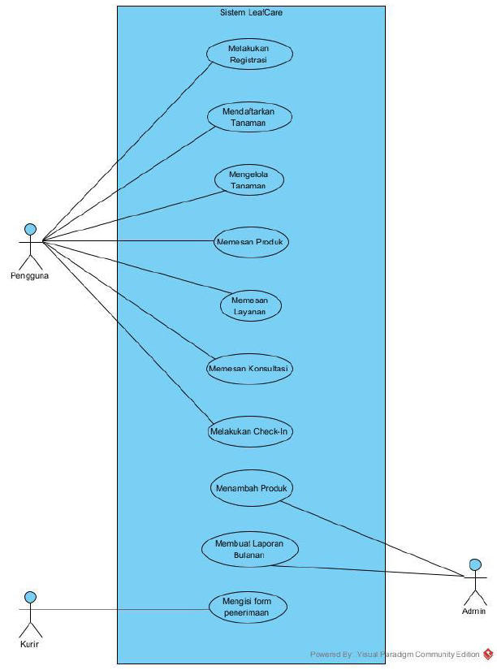
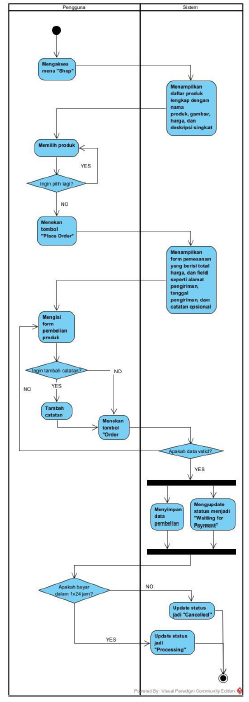
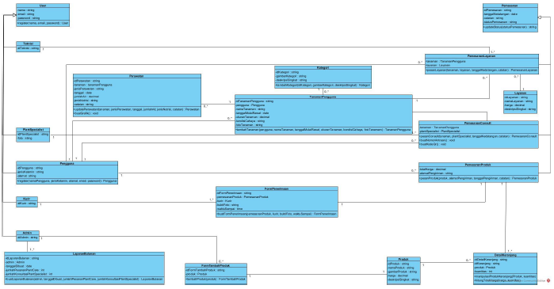
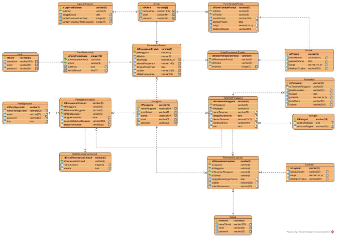
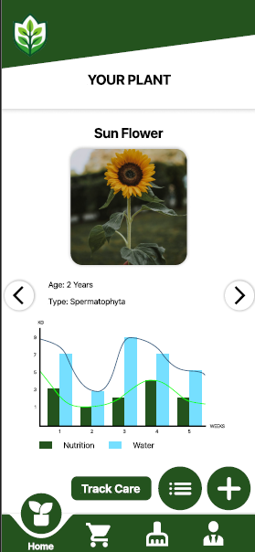

# Leaf Care Design

Saya mendapatkan proyek ini saat training sebagai kandidat System Analyst di Universitas Bina Nusantara. Saya diminta untuk merancang aplikasi mobile untuk pengguna yang gemar merawat tanaman. Saya merancang sistem dengan membuat Use Case Diagram, Activity Diagram, Class Diagram, Entity Relationship Diagram, dan UI sebagai berikut:

1. Use Case Diagram

    

2. Activity Diagram (Memesan Produk)

    

3. Class Diagram

    

4. Entity Relationship Diagram

    

5. UI

    